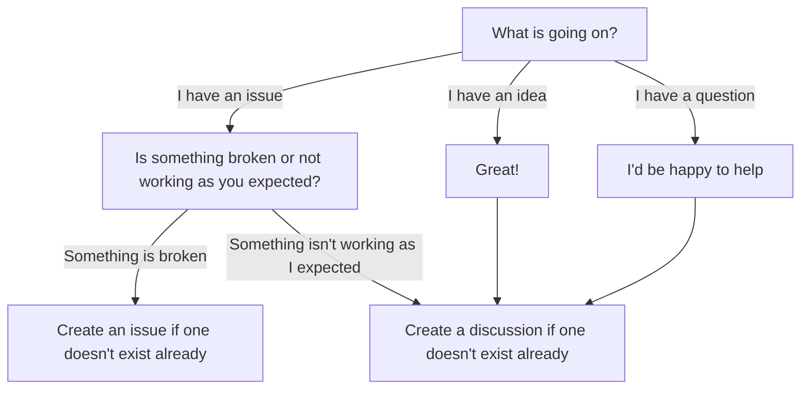

## Creating Issues

You should not immediately create an issue unless you have found a bug. A bug in this library is a fault that causes
StateCraft to produce an incorrect result. Feature requests, new ideas, and unexpected results should be created as a
[Discussion](https://github.com/ZCrewSoftware/ZCrew.StateCraft/discussions) if one does not exist already.



When creating an issue be sure to use the appropriate templates:

- **Feature**: new idea, outline the problem and set clear acceptance criteria
- **Bugfix**: issue, list steps to reproduce and the expectation
- **Task**: non-functional work like documentation or code cleanup
- **Spike**: exploratory work, used to create a proof of concept and then discarded

## Design and LLMs

StateCraft is meant to be pleasant to use, clear, and powerful. While there are a lot of other state machine libraries
out there, I aim for this library to stand out by having *purposeful design*. While LLMs can be useful for writing code,
it still needs to be thoroughly reviewed to ensure that the code adheres to the library's standard. Design is best left
to humans.

Remember: LLMs were trained by distilling code from a large amount of developers. The average developer isn't too great
and half of the developers are worse than that guy.

## Code Style

In this household we don't use underscores for fields. Full stop.

Public code must be documented using XML comments. These comments should be clear, grammatically correct (to the best of
your abilities), and use appropriate tags. If you aren't sure, just look at some other comments.

Cancellation tokens should be commented as `<param name="token">The token to monitor for cancellation requests.</param>`
and should have a `default` value for public members. For private or internal it should **not** be `default`.

## CSharpier

This project uses [CSharpier](https://csharpier.com/) to format code.
A [pre-commit](https://pre-commit.com/) script runs before committing code to ensure the code formatting adheres to the
project's style.
In order to use CSharpier some steps must be taken:

1. Install CSharpier using: `dotnet tool restore`
2. Install python from https://www.python.org/downloads/
3. Install `pre-commit` (version 25.3 has been tested) by running `pip install pre-commit`
4. Install the hooks using `pre-commit install`
5. Optionally: run the pre-commit checks using `pre-commit run --all-files`
    ```
    X:\source\ZCrew.StateCraft>pre-commit run --all-files
    Install .NET tools.......................................................Passed
    Run CSharpier on C# files................................................Passed
    ```
6. Optionally: Install the CSharpier plugin from https://csharpier.com/docs/Editors and set a keyboard shortcut
7. All done! Before committing code you will be notified if there are any formatting issues and CSharpier will fix them
