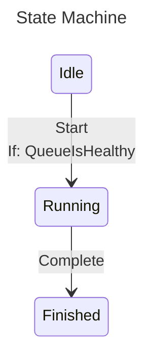

# Mermaid Diagrams

The `ZCrew.StateCraft.Mermaid` package renders a state machine configuration as a
[Mermaid `stateDiagram-v2`](https://mermaid.js.org/syntax/stateDiagram.html) diagram. It is useful for documenting the
shape of a state machine without keeping a hand-written diagram in sync with the code.

## Installation

Add a reference to the `ZCrew.StateCraft.Mermaid` package alongside the core package:

```xml
<PackageReference Include="ZCrew.StateCraft" />
<PackageReference Include="ZCrew.StateCraft.Mermaid" />
```

Then add the namespace:

```csharp
using ZCrew.StateCraft.Mermaid;
```

## Rendering a Diagram

`ToMermaidDiagram()` is an extension on `IStateMachineConfiguration<TState, TTransition>`, so the diagram is produced
directly from the configuration — there is no need to `Build()` the state machine first:

```csharp
enum State { Idle, Running, Finished }
enum Transition { Start, Complete }

static bool QueueIsHealthy() => true;

var configuration = StateMachine
    .Configure<State, Transition>()
    .WithInitialState(State.Idle)
    .WithState(State.Idle, state => state
        .WithTransition(Transition.Start, t => t
            .If(QueueIsHealthy)
            .To(State.Running)))
    .WithState(State.Running, state => state
        .WithTransition(Transition.Complete, State.Finished))
    .WithState(State.Finished, state => state);

var diagram = configuration.ToMermaidDiagram();
```

`diagram` is a `string` containing the diagram text. Write it to a file, embed it in a Markdown document, or paste it
into the [Mermaid live editor](https://mermaid.live).

### Sample Output

The configuration above renders as:

````text
---
title: State Machine
---
stateDiagram-v2
    direction TB

    Idle: Idle
    Running: Running
    Finished: Finished

    Idle --> Running : Start <br/> If: QueueIsHealthy
    Running --> Finished : Complete
````

When passed through a Mermaid renderer it produces:



## Options

`ToMermaidDiagram` has three overloads. Pick whichever fits the call site:

```csharp
// Defaults
configuration.ToMermaidDiagram();

// Explicit options instance
configuration.ToMermaidDiagram(new MermaidOptions
{
    Direction = MermaidDirection.LeftToRight,
    Newline = MermaidNewline.HtmlSingleLineBreak,
});

// Configure callback against a fresh options instance
configuration.ToMermaidDiagram(options =>
{
    options.Direction = MermaidDirection.LeftToRight;
    options.Newline = MermaidNewline.HtmlSingleLineBreak;
});
```

### `Direction`

Sets the layout direction emitted at the top of the diagram (`direction TB` or `direction LR`).

| Value          | Mermaid token | Description                            |
|----------------|---------------|----------------------------------------|
| `TopToBottom`  | `TB`          | States flow top to bottom (default).   |
| `LeftToRight`  | `LR`          | States flow left to right.             |

### `Newline`

Controls how newline characters inside a descriptor (state name, transition descriptor, or condition descriptor) are
rendered. Mermaid does not allow raw newlines inside a descriptor, so they must be transformed:

| Value                 | Behavior                                                                       |
|-----------------------|--------------------------------------------------------------------------------|
| `Ignore`              | Strip newlines entirely; surrounding text is concatenated (default).           |
| `Space`               | Replace each newline with a single space.                                      |
| `HtmlSingleLineBreak` | Replace each newline with `<br/>` so descriptors render as multiple lines.     |

`HtmlSingleLineBreak` is the right choice when descriptors carry multi-line text you want to preserve visually — for
example, larger block-bodied lambda conditions (see the next section).

### Other Encoding Behavior

Regardless of options, descriptors are always escaped to keep Mermaid's parser happy:

- `<` becomes `#lt;`, `>` becomes `#gt;` — so a parameterized state's `<int>` suffix renders as `&ltint&gt`.
- Runs of consecutive spaces have the second-and-later characters replaced with `#nbsp;` so Mermaid does not collapse
  them.

## Tips

### Use the Descriptor Overload for Complex Conditions

Every `If(...)` overload accepts an optional descriptor parameter that defaults to
`[CallerArgumentExpression(nameof(condition))]`. For a method-group reference like `If(QueueIsHealthy)` the captured
expression is just `QueueIsHealthy`, which reads cleanly. But when the condition is a larger inline expression or a
block-bodied lambda, the captured text becomes noisy:

```csharp
// Captured descriptor: "() => { var isAuthorized = this.userService.IsAuthorized(UserId); ..."
.If(() =>
{
    var isAuthorized = this.userService.IsAuthorized(UserId);
    var hasCapacity = Quantity == 0 || this.allocationService.TryAllocate(Quantity, InventoryId);
    return isAuthorized && hasCapacity;
})
```

Pass an explicit descriptor to keep the diagram readable:

```csharp
.If(() => /* same condition as before ... */, "ready to process")
```

The condition then renders as `If: ready to process` instead of the verbatim expression text.

### Prefer Methods or Properties for Conditions When Possible

A method group or property reference makes the diagram self-documenting without needing an explicit descriptor:

```csharp
// Renders property check as: If: QueueIsHealthy
.If(QueueIsHealthy)

// Renders method group as: If: policy.CanCancel
.If(policy.CanCancel)

// Renders lambda method as: If: () => policy.CanCancel
.If(() => policy.CanCancel)
```

## Next Steps

- [Parameterless Transitions](./6-parameterless-transitions.md) - Simple state-to-state transitions
- [Parameterized Transitions](./7-parameterized-transitions.md) - Transitions that carry typed data
- [Mapped Transitions](./8-mapped-transitions.md) - Automatic parameter conversion
- [Reentrant Transitions](./9-reentrant-transitions.md) - Same-parameter transitions
- [Inverted Transitions](./13-inverted-transitions.md) - Define transitions by destination instead of source
