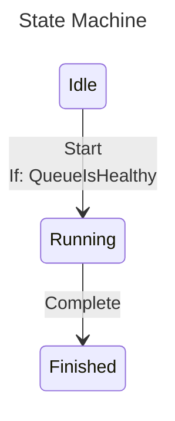

# Mermaid Diagrams

The `ZCrew.StateCraft.Mermaid` package renders a state machine configuration as a
[Mermaid `stateDiagram-v2`](https://mermaid.js.org/syntax/stateDiagram.html), so the diagram never drifts from the
code. For PlantUML output instead, see [PlantUML Diagrams](./plantuml-diagrams.md).

## Installation

Add a reference to the package alongside the core one:

```xml
<PackageReference Include="ZCrew.StateCraft" />
<PackageReference Include="ZCrew.StateCraft.Mermaid" />
```

Then add the namespace:

```csharp
using ZCrew.StateCraft.Mermaid;
```

## Rendering a Diagram

`ToMermaidDiagram()` is an extension on `IStateMachineConfiguration<TState, TTransition>`, so you render straight
from the configuration — there is no need to `Build()` first:

```csharp
enum State { Idle, Running, Finished }
enum Transition { Start, Complete }

static bool QueueIsHealthy() => true;

var configuration = StateMachine
    .Configure<State, Transition>()
    .WithInitialState(State.Idle)
    .WithState(State.Idle, state => state
        .WithTransition(Transition.Start, t => t
            .If(QueueIsHealthy)
            .To(State.Running)))
    .WithState(State.Running, state => state
        .WithTransition(Transition.Complete, State.Finished))
    .WithState(State.Finished, state => state);

var diagram = configuration.ToMermaidDiagram();
```

`diagram` is a `string`. Write it to a file, embed it in a Markdown document, or paste it into the
[Mermaid live editor](https://mermaid.live).

### Sample Output

The configuration above renders as:

````text
---
title: State Machine
---
stateDiagram-v2
    direction TB

    Idle: Idle
    Running: Running
    Finished: Finished

    Idle --> Running : Start <br/> If: QueueIsHealthy
    Running --> Finished : Complete
````

Which a Mermaid renderer draws as:



## Options

`ToMermaidDiagram` has three overloads — defaults, an options instance, or a configure callback:

```csharp
// Defaults
configuration.ToMermaidDiagram();

// Explicit options instance
configuration.ToMermaidDiagram(new MermaidOptions
{
    Direction = MermaidDirection.LeftToRight,
    Newline = MermaidNewline.HtmlSingleLineBreak,
});

// Configure callback against a fresh options instance
configuration.ToMermaidDiagram(options =>
{
    options.Direction = MermaidDirection.LeftToRight;
    options.Newline = MermaidNewline.HtmlSingleLineBreak;
});
```

### `Direction`

The layout direction emitted at the top of the diagram.

| Value         | Mermaid token | Description                          |
|---------------|---------------|--------------------------------------|
| `TopToBottom` | `TB`          | States flow top to bottom (default). |
| `LeftToRight` | `LR`          | States flow left to right.           |

### `Newline`

How newlines inside a descriptor are rendered. Mermaid does not allow raw newlines in a descriptor, so they have
to become something else:

| Value                 | Behavior                                                      |
|-----------------------|---------------------------------------------------------------|
| `Ignore`              | Strip them; the surrounding text runs together (default).     |
| `Space`               | Replace each one with a single space.                         |
| `HtmlSingleLineBreak` | Replace each one with `<br/>` so the descriptor spans lines.  |

Use `HtmlSingleLineBreak` when a descriptor carries multi-line text worth keeping — a block-bodied lambda
condition, for example.

### Other Encoding

Descriptors are always escaped, whatever the options:

- `<` becomes `#lt;` and `>` becomes `#gt;`, so a parameterized state's `<int>` suffix survives Mermaid's parser.
- The second and later spaces in a run become `#nbsp;`, since Mermaid would collapse them.

Conditions are always joined onto the transition descriptor with `<br/>`. The `Newline` option only affects
newlines inside a descriptor's own text.

## Tips

### Name Your Conditions

`If(...)` captures the condition's source text by default, via `[CallerArgumentExpression]`. A method group or
property reads well on its own:

```csharp
.If(QueueIsHealthy)     // If: QueueIsHealthy
.If(policy.CanCancel)   // If: policy.CanCancel
```

A large lambda does not, so pass a descriptor instead:

```csharp
.If(() => /* several lines of conditions... */, "ready to process")
```

That renders as `If: ready to process` rather than the whole expression.
