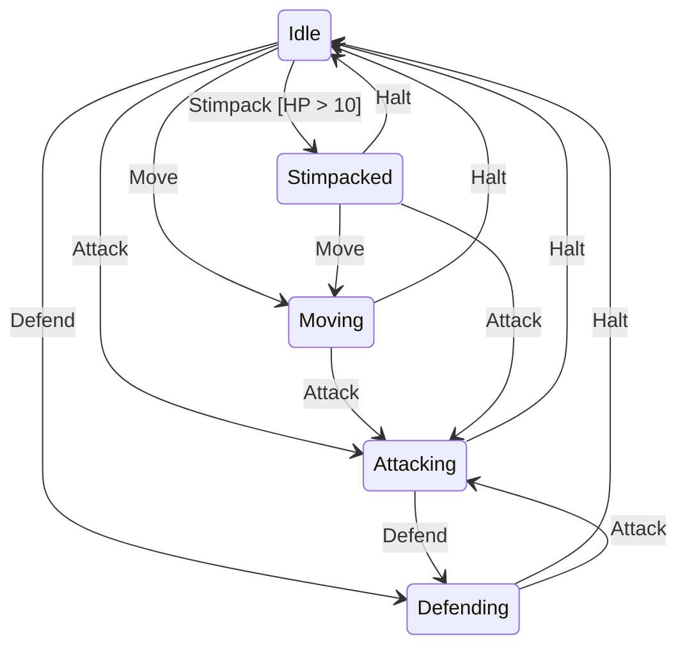

# Marine Sample

A StarCraft-themed console application demonstrating ZCrew.StateCraft's state machine library.

## Features Demonstrated

- **Async actions** (`WithAsynchronousActions`) — background activity continues while the console stays responsive
- **Guard conditions** (`.If(() => marine.Health > 10)`) — Stimpack is only available at sufficient HP
- **Graceful transitions** (`TryTransition`) — invalid commands are handled without exceptions
- **Dynamic commands** (`CanTransition`) — only shows valid transitions for the current state
- **Lifecycle hooks** (`OnStateChange`, `OnEntry`, `OnExit`) — themed console output on state changes

## How to Run

```bash
dotnet run
```

Type transition names (`move`, `attack`, `defend`, `stimpack`, `halt`) to issue commands. Type `quit` to exit.

## State Diagram



## Files

| File                           | Description                                                |
|--------------------------------|------------------------------------------------------------|
| `MarineState.cs`               | State enum: Idle, Moving, Attacking, Defending, Stimpacked |
| `MarineTransition.cs`          | Transition enum: Move, Attack, Defend, Stimpack, Halt      |
| `Marine.cs`                    | Domain model with combat stats and methods                 |
| `GameDisplay.cs`               | Thread-safe Spectre.Console rendering and log display      |
| `MarineStateMachineBuilder.cs` | State machine configuration with transitions and actions   |
| `Program.cs`                   | Entry point with console input loop                        |
