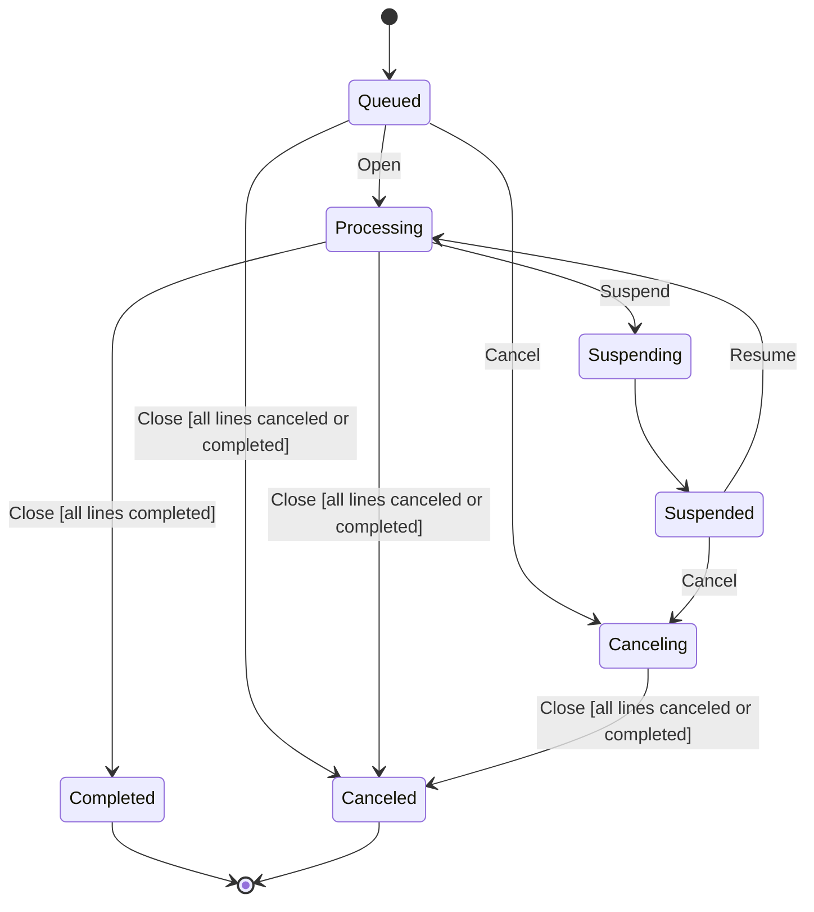
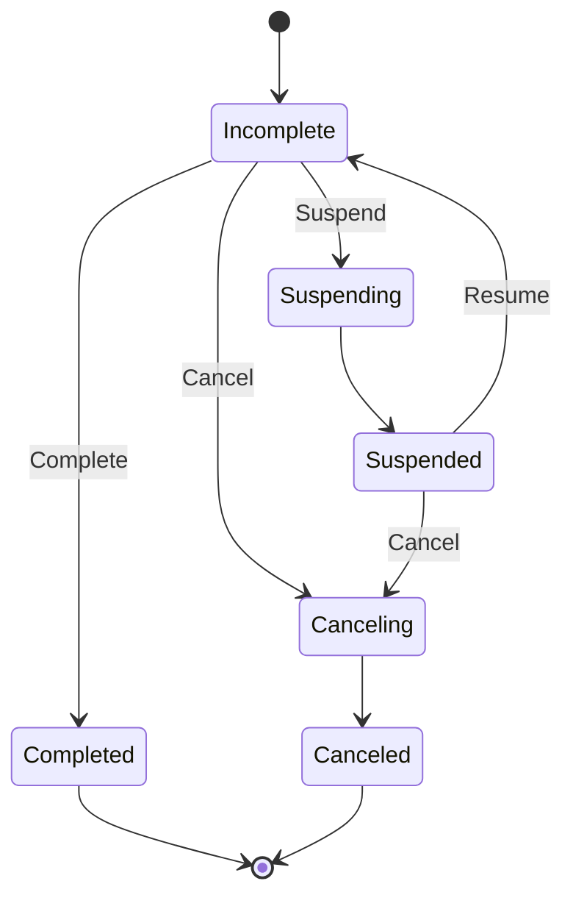

# StateCraft - Order Processor Sample

A Blazor Server application that demonstrates how to use StateCraft to manage complex, hierarchical
state machines with real-time UI updates.

## What This Sample Demonstrates

- **Parameterized states**: `Suspending` and `Canceling` states carry a `string?` reason through their transitions
- **Guard conditions**: the order can only move to `Suspended` or `Completed` when all lines meet specific criteria
- **State actions**: entering `Suspending` or `Canceling` cascades the command to child line state machines
- **Entry callbacks**: lines signal the parent order via async events when they reach terminal or suspended states
- **Triggers**: a repeating trigger watches for line suspensions; a one-shot trigger waits for all lines to close
- **Lifecycle callbacks**: `OnStateChange` persists state to the database after every transition
- **Nested state machines**: each order manages its own state machine plus one state machine per line

## Running the Sample

```bash
dotnet run --project OrderProcessor.Host
```

Then open the URL shown in the console (should be `https://localhost:7051`).

Click **Create Order** to add an order with three lines, then use the buttons to drive transitions
and watch the state changes propagate in real time.

## Order Lifecycle



## Line Lifecycle



## Where to Look

| File                                                    | What it shows                                                        |
|---------------------------------------------------------|----------------------------------------------------------------------|
| `OrderProcessor.Application/Context/OrderContext.cs`    | Order state machine configuration with guards, actions, and triggers |
| `OrderProcessor.Application/Context/LineContext.cs`     | Line state machine with parameterized states and entry callbacks     |
| `OrderProcessor.Domain/Models/OrderState.cs`            | Order state enum with XML docs describing each state                 |
| `OrderProcessor.Domain/Models/LineState.cs`             | Line state enum with XML docs describing each state                  |
| `OrderProcessor.Host/Components/Pages/Home.razor`       | Blazor page that creates orders and polls for updates                |
| `OrderProcessor.Host/Components/Orders/OrderCard.razor` | UI component that drives order transitions                           |

## Project Structure

```
OrderProcessorSample/
├── OrderProcessor.Domain/          Domain models, state enums, command records, contracts
├── OrderProcessor.Application/     StateCraft state machines and command services
├── OrderProcessor.Infrastructure/  EF Core persistence (in-memory database)
└── OrderProcessor.Host/            Blazor Server UI
```
