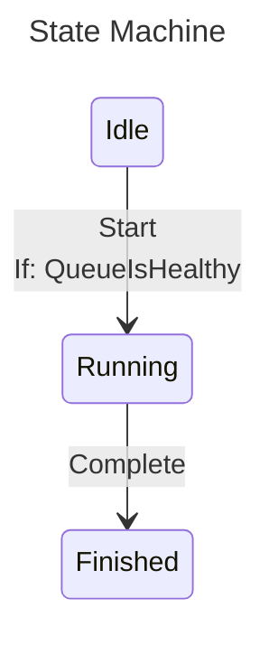

# ZCrew.StateCraft.Mermaid

A Mermaid diagram renderer for [ZCrew.StateCraft](https://www.nuget.org/packages/ZCrew.StateCraft). Render any state machine configuration as a [Mermaid `stateDiagram-v2`](https://mermaid.js.org/syntax/stateDiagram.html) diagram so documentation stays in sync with the code rather than being hand-maintained alongside it.

## Features

- **One-line rendering** - `ToMermaidDiagram()` produces the diagram from a configuration; no need to `Build()` first
- **[Layout direction](docs/14-mermaid-diagrams.md#direction)** - Top-to-bottom or left-to-right layouts
- **[Newline handling](docs/14-mermaid-diagrams.md#newline)** - Strip newlines, replace them with spaces, or render them as `<br/>` line breaks inside descriptors
- **Condition descriptors** - Guarded transitions render with `If` / `And` clauses pulled from each condition's descriptor
- **Parameterized state support** - Type parameters appear in both the state identifier and its descriptor
- **Mermaid-safe escaping** - Angle brackets and consecutive spaces are encoded so the diagram parses cleanly

## Installation

This package is available on NuGet as `ZCrew.StateCraft.Mermaid` for these frameworks:

- .NET 8.0
- .NET 9.0
- .NET 10.0

```xml
<PackageReference Include="ZCrew.StateCraft" Version="1.0.0" />
<PackageReference Include="ZCrew.StateCraft.Mermaid" Version="1.0.0" />
```

## Quick Start

`ToMermaidDiagram()` is an extension on `IStateMachineConfiguration<TState, TTransition>`:

```csharp
using ZCrew.StateCraft;
using ZCrew.StateCraft.Mermaid;

enum State { Idle, Running, Finished }
enum Trigger { Start, Complete }

static bool QueueIsHealthy() => true;

var configuration = StateMachine
    .Configure<State, Trigger>()
    .WithInitialState(State.Idle)
    .WithState(State.Idle, state => state
        .WithTransition(Trigger.Start, t => t
            .If(QueueIsHealthy)
            .To(State.Running)))
    .WithState(State.Running, state => state
        .WithTransition(Trigger.Complete, State.Finished))
    .WithState(State.Finished, state => state);

var diagram = configuration.ToMermaidDiagram();
```

`diagram` is a `string` containing the diagram text — write it to a file, embed it in a Markdown document, or paste it into the [Mermaid live editor](https://mermaid.live).

### Sample Output

The configuration above renders as:



### Options

`ToMermaidDiagram` has three overloads — defaults, an explicit `MermaidOptions` instance, or a configure callback:

```csharp
// Defaults
configuration.ToMermaidDiagram();

// Explicit options instance
configuration.ToMermaidDiagram(new MermaidOptions
{
    Direction = MermaidDirection.LeftToRight,
    Newline = MermaidNewline.HtmlSingleLineBreak,
});

// Configure callback against a fresh options instance
configuration.ToMermaidDiagram(options =>
{
    options.Direction = MermaidDirection.LeftToRight;
    options.Newline = MermaidNewline.HtmlSingleLineBreak;
});
```

### Readable Conditions

Every `If(...)` overload accepts an optional descriptor that defaults to `[CallerArgumentExpression]`. Method groups and properties produce clean descriptors out of the box; for complex inline lambdas, pass an explicit descriptor so the diagram stays readable:

```csharp
.If(() => /* large block-bodied condition... */, "ready to process")
```

The condition then renders as `If: ready to process` instead of the verbatim expression text.

## Documentation

For detailed documentation, see [Mermaid Diagrams](docs/14-mermaid-diagrams.md) in the docs folder.

## License

This project is licensed under the MIT License - see the [LICENSE.md](LICENSE.md) file for details.