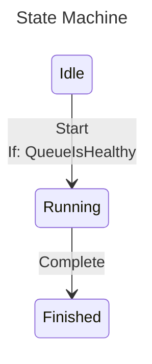

# ZCrew.StateCraft.Mermaid

A Mermaid renderer for [ZCrew.StateCraft](https://www.nuget.org/packages/ZCrew.StateCraft). Render any state machine configuration as a [Mermaid `stateDiagram-v2`](https://mermaid.js.org/syntax/stateDiagram.html), so the diagram never drifts from the code.

## Features

- **One-line rendering** - `ToMermaidDiagram()` works straight off a configuration; no `Build()` needed
- **[Layout direction](https://github.com/ZCrewSoftware/ZCrew.StateCraft/blob/main/docs/mermaid-diagrams.md#direction)** - Top-to-bottom or left-to-right
- **[Newline handling](https://github.com/ZCrewSoftware/ZCrew.StateCraft/blob/main/docs/mermaid-diagrams.md#newline)** - Strip newlines, turn them into spaces, or render them as `<br/>`
- **Condition descriptors** - Guarded transitions render with `If` / `And` clauses
- **Parameterized states** - Type parameters appear in the state identifier and its descriptor
- **Mermaid-safe escaping** - Angle brackets and runs of spaces are encoded so the diagram parses cleanly

## Installation

This package is available on NuGet as `ZCrew.StateCraft.Mermaid` for these frameworks:

- .NET 8.0
- .NET 9.0
- .NET 10.0

```xml
<PackageReference Include="ZCrew.StateCraft" Version="1.0.0" />
<PackageReference Include="ZCrew.StateCraft.Mermaid" Version="1.0.0" />
```

## Quick Start

`ToMermaidDiagram()` is an extension on `IStateMachineConfiguration<TState, TTransition>`:

```csharp
using ZCrew.StateCraft;
using ZCrew.StateCraft.Mermaid;

enum State { Idle, Running, Finished }
enum Trigger { Start, Complete }

static bool QueueIsHealthy() => true;

var configuration = StateMachine
    .Configure<State, Trigger>()
    .WithInitialState(State.Idle)
    .WithState(State.Idle, state => state
        .WithTransition(Trigger.Start, t => t
            .If(QueueIsHealthy)
            .To(State.Running)))
    .WithState(State.Running, state => state
        .WithTransition(Trigger.Complete, State.Finished))
    .WithState(State.Finished, state => state);

var diagram = configuration.ToMermaidDiagram();
```

`diagram` is a `string` — write it to a file, embed it in a Markdown document, or paste it into the [Mermaid live editor](https://mermaid.live).

### Sample Output

The configuration above renders as:


```mermaid
---
title: State Machine
---
stateDiagram-v2
    direction TB

    Idle: Idle
    Running: Running
    Finished: Finished

    Idle --> Running : Start <br/> If: QueueIsHealthy
    Running --> Finished : Complete
```

### Options

Three overloads — defaults, a `MermaidOptions` instance, or a configure callback:

```csharp
// Defaults
configuration.ToMermaidDiagram();

// Explicit options instance
configuration.ToMermaidDiagram(new MermaidOptions
{
    Direction = MermaidDirection.LeftToRight,
    Newline = MermaidNewline.HtmlSingleLineBreak,
});

// Configure callback against a fresh options instance
configuration.ToMermaidDiagram(options =>
{
    options.Direction = MermaidDirection.LeftToRight;
    options.Newline = MermaidNewline.HtmlSingleLineBreak;
});
```

### Readable Conditions

`If(...)` captures the condition's source text by default. Method groups and properties read well on their own; for a large lambda, pass a descriptor instead:

```csharp
.If(() => /* several lines of conditions... */, "ready to process")
```

That renders as `If: ready to process` rather than the whole expression.

## Documentation

See [Mermaid Diagrams](https://github.com/ZCrewSoftware/ZCrew.StateCraft/blob/main/docs/mermaid-diagrams.md) for the full documentation.

## License

This project is licensed under the MIT License - see the [LICENSE.md](https://github.com/ZCrewSoftware/ZCrew.StateCraft/blob/main/LICENSE.md) file for details.
